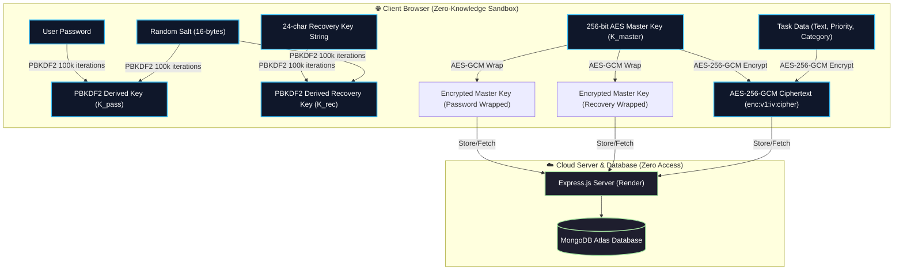

<div align="center">

# 🔒 TaskFlow E2EE

### *Zero-Knowledge End-to-End Encrypted Task & Reminder Management*

[](https://react.dev/)
[](https://vitejs.dev/)
[](https://nodejs.org/)
[](https://www.mongodb.com/)
[](https://developer.mozilla.org/en-US/docs/Web/API/Web_Crypto_API)
[](https://vercel.com/)

<p align="center">
  TaskFlow is a modern, high-performance web application engineered with <strong>Zero-Knowledge End-to-End Encryption (E2EE)</strong>. Your tasks, priorities, and categories are encrypted natively in your browser using <strong>AES-256-GCM</strong> before being sent to the database. Neither server admins nor database providers can ever access your data.
</p>

</div>

---

## ✨ Features & Highlights

- 🔒 **Zero-Knowledge E2EE Engine**: Native browser Web Crypto API (`SubtleCrypto`) utilizing `PBKDF2` (100,000 iterations, SHA-256) key derivation and `AES-256-GCM` encryption.
- 🔑 **Client-Side Recovery Key System**: Formatted 24-character Recovery Key (e.g. `A4B8-9F22-C110-E7D3-488B-62FA`) for zero-knowledge password resets without losing encrypted data.
- 🛡️ **Account Settings & Security**: View & copy your Recovery Key with mandatory **password re-prompt** verification, update email, re-wrap master key on password change, or permanently delete account.
- 🎨 **Apple Design Aesthetics**: Vibrant glassmorphism UI, smooth micro-animations, Apple Light & OLED Dark Mode with auto preference memory, and viewport-centered modal portals.
- 🏷️ **Smart Task Organization**: Priority tagging (High, Medium, Low), category segmentation (Work, Personal, Shopping, General), real-time search filtering, and progress tracking.
- ⚡ **Full-Stack Architecture**: Express.js REST API on Render connected to MongoDB Atlas, with a lightning-fast React + Vite SPA on Vercel.

---

## 🔐 Zero-Knowledge Cryptography Architecture



### Key Security Warranties:
1. **Plaintext Isolation**: Plaintext tasks and raw Master Keys exist **only** in active browser session memory (`sessionStorage`) while logged in.
2. **Double Key Wrapping**: The random 256-bit Master Key ($K_{\text{master}}$) is encrypted twice:
   - Wrapped with Password-derived key ($K_{\text{pass}}$).
   - Wrapped with Recovery-derived key ($K_{\text{rec}}$).
3. **Database Privacy**: MongoDB Atlas stores **only** wrapped key JSON structures and ciphertext strings prefixed with `enc:v1:<iv>:<ciphertext>`.

---

## 🛠️ Tech Stack

### Frontend
- **Framework**: React 18
- **Build Tool**: Vite 8
- **Styling**: Vanilla CSS (Apple System Design Tokens, Glassmorphism)
- **Icons**: Lucide React
- **Cryptography**: Native Web Crypto API (`window.crypto.subtle`)
- **HTTP Client**: Axios

### Backend
- **Runtime**: Node.js
- **Framework**: Express.js
- **Database**: MongoDB Atlas (via Mongoose ODM)
- **Authentication**: JWT (JSON Web Tokens) & bcrypt
- **Security Middleware**: CORS, Environment variable injection

---

## 📁 Repository Structure

```text
todo-fullstack/
├── backend/
│   ├── middleware/
│   │   └── auth.js            # JWT Authentication Guard
│   ├── models/
│   │   ├── User.js            # Zero-Knowledge User Schema
│   │   └── Task.js            # Encrypted Task Schema
│   ├── routes/
│   │   ├── auth.js            # Registration, Login, Profile & Recovery Routes
│   │   └── tasks.js           # CRUD Task Routes
│   ├── .env                   # Server Environment Variables (Secret)
│   ├── package.json
│   └── server.js              # Express Server Entry Point
│
├── frontend/
│   ├── src/
│   │   ├── components/
│   │   │   ├── AuthModal.jsx   # Login, Register & Forgot Password Modal
│   │   │   ├── ProfileModal.jsx# Account Settings & Recovery Key Re-prompt Modal
│   │   │   └── Header.jsx      # Navigation Bar & Account Actions
│   │   ├── context/
│   │   │   ├── AuthModalContext.jsx
│   │   │   └── ThemeContext.jsx
│   │   ├── pages/
│   │   │   ├── Home.jsx        # Landing Page (E2EE Highlights & Interactive Demo)
│   │   │   └── Todo.jsx        # Reminders Dashboard with Client Decryption
│   │   ├── utils/
│   │   │   └── crypto.js       # Web Crypto E2EE Engine (PBKDF2, AES-256-GCM)
│   │   ├── App.jsx
│   │   └── config.js           # API Base URL Config
│   ├── package.json
│   └── vite.config.js
└── README.md
```

---

## 🚀 Getting Started

### Prerequisites
- **Node.js**: v18.0.0 or higher
- **npm**: v9.0.0 or higher
- **MongoDB Atlas**: Connection URI string

---

### 1. Backend Setup

```bash
# Navigate to backend directory
cd backend

# Install dependencies
npm install

# Create .env file
cat <<EOT > .env
PORT=5000
MONGO_URI=your_mongodb_atlas_connection_string
JWT_SECRET=your_super_secret_jwt_key
EOT

# Start backend dev server (Nodemon)
npm run dev
```

The backend server will run on `http://localhost:5000`.

---

### 2. Frontend Setup

```bash
# Navigate to frontend directory
cd frontend

# Install dependencies
npm install

# (Optional) Create .env file for custom backend URL
cat <<EOT > .env
VITE_API_URL=http://localhost:5000
EOT

# Start frontend dev server (Vite)
npm run dev
```

Open `http://localhost:5173` in your browser.

---

## 📡 API Endpoints

### Authentication & Zero-Knowledge Routes (`/api/auth`)

| Method | Endpoint | Description | Access |
| :--- | :--- | :--- | :--- |
| `POST` | `/api/auth/register` | Register new user with encrypted master key wrappers | Public |
| `POST` | `/api/auth/login` | Authenticate user & return JWT + key wrappers | Public |
| `POST` | `/api/auth/user-key-params` | Fetch user salt & recovery key wrapper for recovery | Public |
| `POST` | `/api/auth/recover-account` | Recover account & re-wrap master key with new password | Public |
| `PUT` | `/api/auth/profile` | Update email, password & re-wrapped master key | Private (JWT) |
| `DELETE`| `/api/auth/account` | Delete user account & remove all associated tasks | Private (JWT) |

### Encrypted Task Routes (`/api/tasks`)

| Method | Endpoint | Description | Access |
| :--- | :--- | :--- | :--- |
| `GET` | `/api/tasks` | Fetch user's encrypted tasks | Private (JWT) |
| `POST` | `/api/tasks` | Create new encrypted task | Private (JWT) |
| `PUT` | `/api/tasks/:id` | Update task completion status or content | Private (JWT) |
| `DELETE`| `/api/tasks/:id` | Delete task | Private (JWT) |

---

## 🌟 Security Best Practices Implemented

- **Password Hashing**: Passwords hashed with `bcrypt` (salt factor 10) before database storage.
- **Master Key Generation**: Native cryptographically secure 256-bit random keys (`window.crypto.getRandomValues`).
- **PBKDF2 Key Derivation**: 100,000 SHA-256 iterations to resist brute-force attacks.
- **AES-GCM Authenticated Encryption**: Guarantees confidentiality and data integrity via 96-bit random IVs per cipher operations.
- **Session Privacy**: Plaintext master keys stored exclusively in `sessionStorage` and automatically cleared when closing the browser tab.

---

<div align="center">

Crafted with ❤️ for Privacy and Performance.

</div>